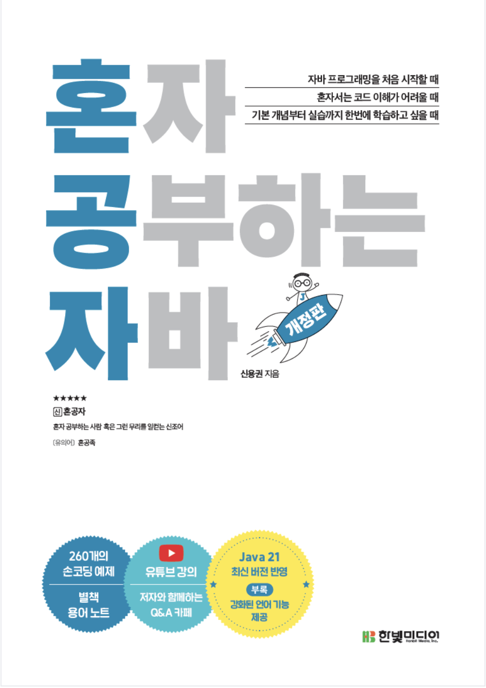

# 🧠 개발자 성장을 위한 전체 학습 레포지토리
이 레포지토리는 개발자로 성장하기 위한 전반적인 학습 기록과 스터디 정리 공간입니다.
혼자 공부한 내용부터 여러 명이 함께 진행한 스터디, 그리고 기술 문서(RFC) 분석까지 지식이 축적되는 학습 아카이브를 목표로 구성했습니다.

# 레포지토리 구성 개요 
이 저장소는 크게 아래와 같은 학습 영역으로 구성되어 있습니다.
- Spring/Backend 스터디
- 도서 기반 개인 학습 정리
- 표준 문서(RFC) 기반 기술 정리
- 언어(java) 기초 및 실습 코드
```
📦 codyssey
├─ groupStudy
│  └─ 📁 spring-study
│     └─ README.md
│
├─ book
│   ├─ 📁 StudyingJavaonYourOwn
    │  └─ README.md
│   └─ 📁 image
│ 
├─ java
│  └─ 📁 00-collectionframework
│
├─ RFC
│ └─ 📁 OAuth
│   ├─ 📁 00-abstract
│   └─ 📁 01-introduction 
│
└─ README.md # 전체 학습 레포지토리 소개
```
## 🌱 혼자 공부하기(`book`)
> 도서를 기반으로 한 Java 기초부터 객체지향 개념까지의 개인 학습 정리입니다.


### 1. 혼자 공부하는 자바 - (`StudyingJavaonYourOwn`)
도서를 기반으로 한 Java 기초부터 객체지향 개념까지의 개인 학습 정리입니다.

[👉 혼자 공부하는 자바 정리 바로가기](./book/StudyingJavaonYourOwn/README.md)

- 책은 이 책으로 진행하였습니다.
<p align="center">
  
</p>


## 📘 Spring/Backend 스터디(`groupStudy 폴더`)

### 1. 스프링 부트 스터디(`spring-study`)
25년 주니어 및 취준생 분들과 함께한 스터디 진행 기록입니다. 스프링 프레임워크 스터디를 진행 했습니다. 기여해주시는 멘토님들께 항상 감사드립니다.

</br>

공부 정리 폴더는 밑 링크로 이동하시면 됩니다.

[👉 스프링 부트 공부 정리 바로가기](./groupStudy/spring-study/README.md)


<p align="center">
  
</p>

- 책은 이 책으로 진행하였습니다.


## ☕ Java 실습 및 개념 정리 (`java`)
> Java 언어 학습 과정에서 작성한 실습 코드 모음입니다.

### 1. collectionFramework(`collectionFramework`)
- 자바의 컬렉션 프레임워크 실습을 진행해보았습니다.


## 📑 RFC (`RFC`)
> RFC 문서를 직접 읽고 해석하며 정리한 기술 문서 학습 공간입니다.

### 1. OAuth 2.0(`Oauth`)
[👉 OAuth 2.0 정리 바로가기](./RFC/OAuth/README.md)
