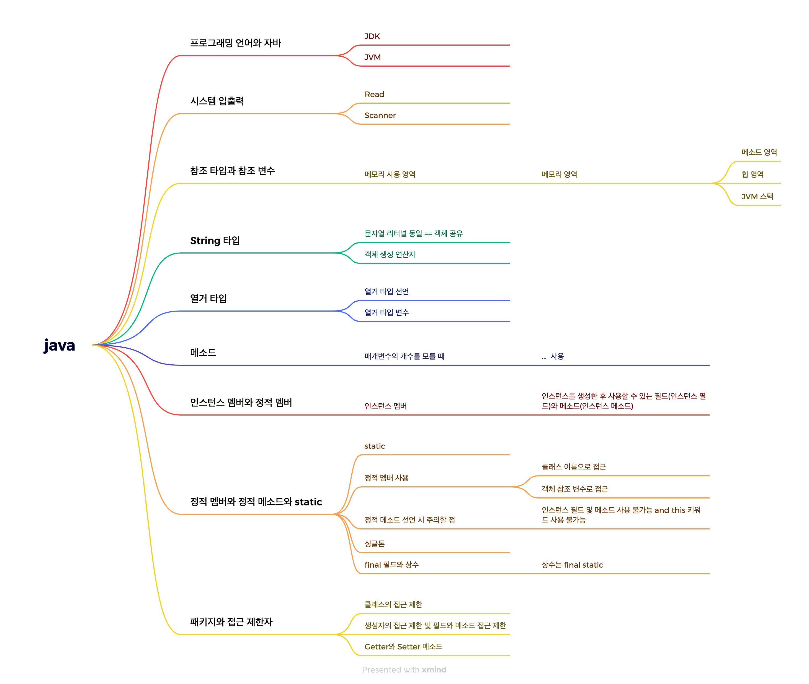

# 혼자 공부하는 자바 정리
> 알고 있는 내용은 제외하고, 이해가 부족했던 부분 위주로 정리했습니다.  
> 개념 설명은 블로그에 정리하고, 이 레포지토리에는 구조와 코드만 남깁니다.

</br>

## 📂 학습 방식
- README: 챕터별 학습 범위 및 구조 정리
- 코드 폴더: 직접 작성한 예제 및 개념 검증 코드
- 블로그: 개념 설명 및 학습 과정 정리 (`java` 카테고리)

</br>


## 학습 내용
```
관련 코드는 블로그에 연결되어있습니다.
```

- [자바란 무엇인가?](https://wo-dbs.tistory.com/286)
- [시스템 입출력](https://wo-dbs.tistory.com/287)
- [참조 타입과 참조 변수](https://wo-dbs.tistory.com/288)
- [String 타입](https://wo-dbs.tistory.com/289)
- [열거 타입](https://wo-dbs.tistory.com/290)
- [메소드](https://wo-dbs.tistory.com/291)
- [인스턴스 멤버와 정적 멤버](https://wo-dbs.tistory.com/292)
- [접근 제한자](https://wo-dbs.tistory.com/293)
- [상속](https://wo-dbs.tistory.com/294)
- [타입 변환과 다형성](https://wo-dbs.tistory.com/295)
- [추상 클래스](https://wo-dbs.tistory.com/296)
- [인터페이스](https://wo-dbs.tistory.com/297)
- [인터페이스 타입과 변환과 다형성](https://wo-dbs.tistory.com/298)
- [중첩 클래스와 중첩 인터페이스](https://wo-dbs.tistory.com/299)
- [익명 객체](https://wo-dbs.tistory.com/300)
- [예외 처리](https://wo-dbs.tistory.com/301)
- [기본 API 클래스](https://wo-dbs.tistory.com/302)
- [스레드](https://wo-dbs.tistory.com/303)
- [컬렉션 프레임워크](https://wo-dbs.tistory.com/304)
- [입출력 스트림](https://wo-dbs.tistory.com/305)

## 학습 내용 날짜 별 정리
2025년 12/17(수)
<p align="center">
  
</p>

2025년 12/20(토)
<p align="center">
  
</p>