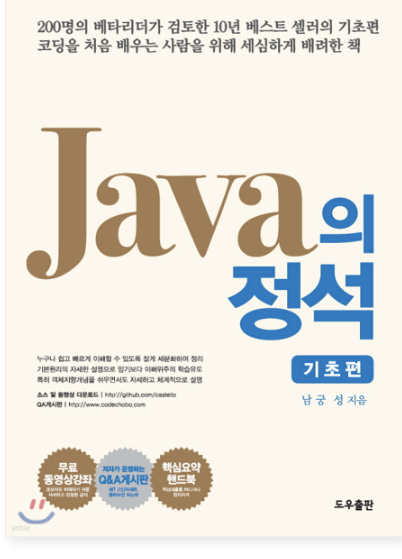

# 📕 자바의 정석 - 기초편

> 기초 문법은 이미 학습한 상태에서 java의 내용을 좀 더 알기 위해 읽어보았습니다.
>
> 이 책에서 새롭게 이해한 내용은 **기존 블로그 글에 추가 및 보완하는 방식으로 통합 정리**했습니다.

  

---

## 🧭 이 책을 통해 보완한 개념

---

## 🔗 연결된 블로그
👉 각 개념은 **기존 블로그 글에 반영**
- 카테고리: https://wo-dbs.tistory.com/category/java

## 🔗 연결된 레포지토리
- [java 레포지토리 바로가기](../../java/README.md)

---