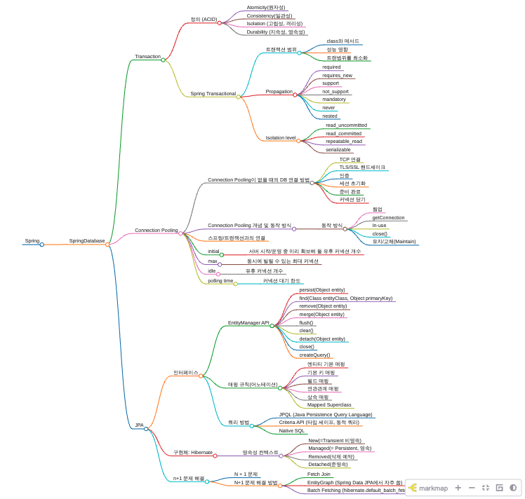

# 🌱 Spring Boot 스터디 정리

스터디에서 다룬 내용을 챕터별로 정리하고, 블로그 글도 함께 링크합니다.

## Chapter 1 - 스프링 부트란?

<table>
  <tr>
    <th>주제</th>
    <th>블로그 링크</th>
  </tr>
  <tr>
    <td>제어역전 IoC</td>
    <td>
      
    </td>
  </tr>
  <tr>
    <td>의존성 주입(DI)</td>
    <td>
      
    </td>
  </tr>
  <tr>
    <td>관점 지향 프로그래밍(AOP)</td>
    <td>
      
    </td>
  </tr>
  <tr>
    <td>스프링 프레임워크의 다양한 모듈</td>
    <td>
      
    </td>
  </tr>
  <tr>
    <td>스프링 프레임워크 vs 스프링 부트</td>
    <td>
      
    </td>
  </tr>
    <tr>
    <td>의존성 관리</td>
    <td>
      
    </td>
  </tr>
    <tr>
    <td>자동 설정</td>
    <td>
      
    </td>
  </tr>
    <tr>
    <td>내장 WAS</td>
    <td>
      
    </td>
</table>

 

## Chapter 2 - 개발에 앞서 알면 좋은 기초 지식

<table>
  <tr>
    <th>주제</th>
    <th>블로그 링크</th>
  </tr>
  <tr>
    <td>서버 간 통신</td>
    <td>
      
    </td>
  </tr>
  <tr>
    <td>스프링부트의 동작 방식</td>
    <td>
      
    </td>
  </tr>
  <tr>
    <td>레이어드 아키텍처</td>
    <td>
      
    </td>
  </tr>
  <tr>
    <td>디자인 패턴</td>
    <td>
      
    </td>
  </tr>
  <tr>
    <td>REST API</td>
    <td>
      
    </td>
  </tr>
  
</table>

 

## Chapter 5 - API를 작성하는 다양한 방법

  

<table>
  <tr>
    <th>주제</th>
    <th>블로그 링크</th>
  </tr>
  <tr>
    <td>GET API 만들기</td>
    <td>
      
    </td>
  </tr>
  <tr>
    <td>POST API 만들기</td>
    <td>
      
    </td>
  </tr>
  <tr>
    <td>PUT API 만들기</td>
    <td>
      
    </td>
  </tr>
  <tr>
    <td>DELETE API 만들기</td>
    <td>
      
    </td>
  </tr>
  <tr>
    <td>REST API 명세 문서화</td>
    <td>
      
    </td>
  </tr>
    <tr>
    <td>로깅 라이브러리 - Logback</td>
    <td>
      
    </td>
  </tr>
  
</table>

 

## Chapter 6 - 데이터베이스 연동

  

<table>
  <tr>
    <th>주제</th>
    <th>블로그 링크</th>
  </tr>
  <tr>
    <td>마리아 DB 설치</td>
    <td>
      
    </td>
  </tr>
  <tr>
    <td>ORM</td>
    <td>
      
    </td>
  </tr>
  <tr>
    <td>JPA</td>
    <td>
      
    </td>
  </tr>
  <tr>
    <td>하이버네이트</td>
    <td>
      
    </td>
  </tr>
  <tr>
    <td>영속성 컨텍스트</td>
    <td>
      
    </td>
  </tr>
  <tr>
  <td>데이터베이스 연동 - 실습</td>
    <td>
      
    </td>
  </tr>
    <tr>
    <td>엔티티 설계 - 실습</td>
    <td>
      
    </td>
  </tr>
    <tr>
    <td>리포지터리 인터페이스 설계 - 실습</td>
    <td>
      
    </td>
  </tr>
    <tr>
    <td>DAO 설계</td>
    <td>
      
    </td>
  </tr>
    <tr>
    <td>DAO 연동을 위한 컨트롤러와 서비스 설계</td>
    <td>
      
    </td>
  </tr>
</table>

## 데이터베이스 커넥션

  

<table>
  <tr>
    <th>주제</th>
    <th>블로그 링크</th>
  </tr>
  <tr>
    <td>ACID</td>
    <td>
      
    </td>
  </tr>
  <tr>
    <td>트랜잭션범위(Class, Method)</td>
    <td>
      
    </td>
  </tr>
  <tr>
    <td>Propagation</td>
    <td>
      
    </td>
  </tr>
  <tr>
    <td>Isolation Level</td>
    <td>
      
    </td>
  </tr>
  <tr>
    <td>Connection Pooling</td>
    <td>
      
    </td>
  </tr>
  <tr>
  <td>ㄷEntityManager API</td>
    <td>
      
    </td>
  </tr>
    <tr>
    <td>매핑 규칙(어노테이션)</td>
    <td>
      
    </td>
  </tr>
    <tr>
    <td>리포지터리 인터페이스 설계 - 실습</td>
    <td>
      
    </td>
  </tr>
    <tr>
    <td>쿼리 방법(JPQL/Criteria)</td>
    <td>
      
    </td>
  </tr>
    <tr>
    <td>영속성 컨텍스트</td>
    <td>
      
    </td>
  </tr>
    <tr>
    <td>N + 1 문제 해결</td>
    <td>
      
    </td>
  </tr>
</table>

