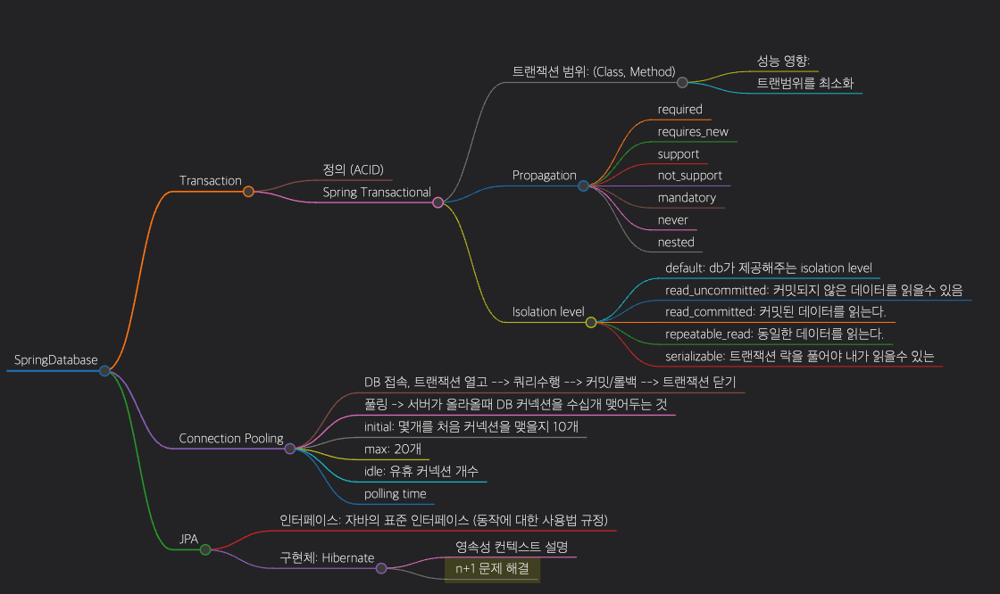
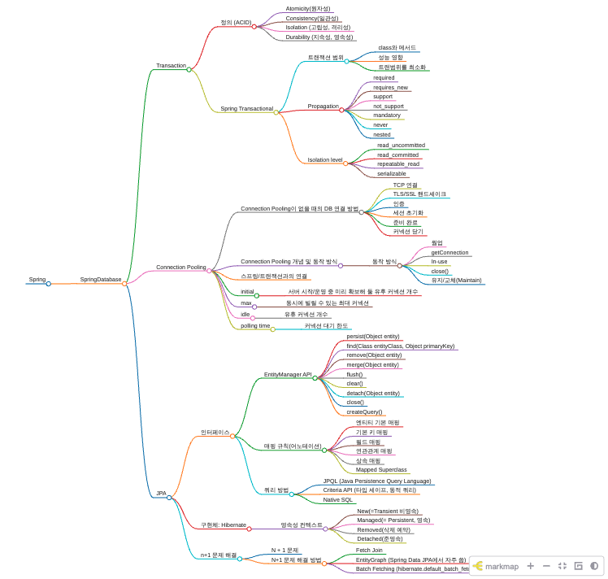

# Spring 

## SpringDatabase
- 멘토님 그림

  

[connectionpool.html 열기](./image/connectionpool.html)

  

### Transaction
- 정의 (ACID)
    - Atomicity(원자성)
    - Consistency(일관성)
    - Isolation (고립성, 격리성)
    - Durability (지속성, 영속성)
- Spring Transactional
  - 트랜잭션 범위
    - class와 메서드
    - 성능 영향
    - 트랜범위를 최소화
  - Propagation
    - required
    - requires_new
    - support
    - not_support
    - mandatory
    - never
    - nested
  - Isolation level
    - read_uncommitted
    - read_committed
    - repeatable_read
    - serializable
### Connection Pooling
- Connection Pooling이 없을 때의 DB 연결 방법
    - TCP 연결
    - TLS/SSL 핸드셰이크
    - 인증
    - 세션 초기화
    - 준비 완료
    - 커넥션 닫기
- Connection Pooling 개념 및 동작 방식
    - 동작 방식
        - 웜업
        - getConnection
        - In-use
        - close()
        - 유지/교체(Maintain)
- 스프링/트랜잭션과의 연결
- initial
    - 서버 시작/운영 중 미리 확보해 둘 유후 커넥션 개수
- max
    - 동시에 빌릴 수 있는 최대 커넥션 
- idle
    - 유휴 커넥션 개수
- polling time
    - 커넥션 대기 한도

### JPA
- 인터페이스
    - EntityManager API
        - persist(Object entity)
        - find(Class<T> entityClass, Object primaryKey)
        - remove(Object entity)
        - merge(Object entity)
        - flush()
        - clear()
        - detach(Object entity)
        - close()
        - createQuery()
    - 매핑 규칙(어노테이션)
        - 엔티티 기본 매핑
        - 기본 키 매핑
        - 필드 매핑
        - 연관관계 매핑
        - 상속 매핑
        - Mapped Superclass
    - 쿼리 방법
        - JPQL (Java Persistence Query Language)
        - Criteria API (타입 세이프, 동적 쿼리)
        - Native SQL
- 구현체: Hibernate
    - 영속성 컨텍스트
        - New(=Transient 비영속)
        - Managed(= Persistent, 영속)
        - Removed(삭제 예약)
        - Detached(준영속)
- n+1 문제 해결
    - N + 1 문제
    - N+1 문제 해결 방법
        - Fetch Join
        - EntityGraph (Spring Data JPA에서 자주 씀)
        - Batch Fetching (hibernate.default_batch_fetch_size)

